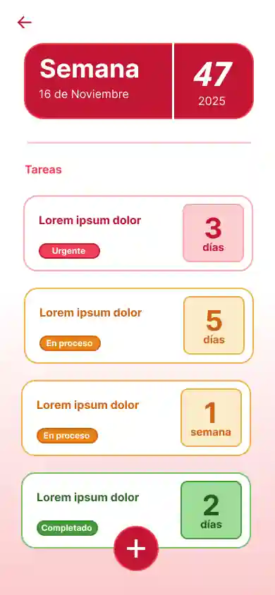

# CurrentWeek

CurrentWeek es una pequeña aplicación de productividad para organizar tareas por semanas con un estilo tipo Kanban. Las tareas pueden estar en estado todo, doing o done y muestran un contador (horas/días/semanas) que indica cuánto tiempo queda hasta la fecha final.

## ✨ Características principales

Añadir / editar / borrar tareas.
Tres estados: Por hacer, Haciendo, Hecho (kanban-like).
Visualización del tiempo restante junto a cada tarea (horas/días/semanas).
UI modular con CSS Modules y componentes React en TypeScript.
Estructura preparada para localizaciones (hay archivos en.json y es.json).

## 🛠️ Tecnologías

- React 19 + TypeScript
- Vite como bundler/dev server
- CSS Modules para estilos
- Dependencias mínimas (sin librería de fechas por ahora)

## 📁 Estructura relevante del proyecto

- App.tsx — Punto de entrada y estado principal.
- Task.ts — Tipos e interfaces (Task, Difference).
- getDates.ts — Cálculo de la semana y diferencia de fechas.
- Components — Componentes: Tasks/, Panel/, Buttons/, CurrentWeek/.

---

## 📷 Capturas

---

## 🔑 Licencia

Este proyecto se distribuye bajo una licencia de uso no comercial con atribución.
Ver archivo LICENSE para más información.
